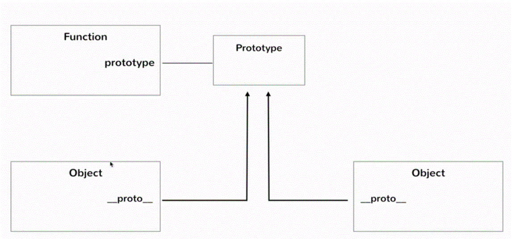

# JavaScript Objects and Prototypes In-depth

##Unit 1 Creating Objects

**Approach 1:**

```js
var emp1 = {};
emp1.firstName = "Michael";
emp1.lastName = "Scott";
emp1.gender = "M";
emp1.designation = "Regional Manager";

// OR
var emp1 = {
    "firstName": "Michael",
    "lastName": "Scott",
    "gender": "M",
    "designation": "Regional Manager"
};
```

但是使用上述的方法很容易漏掉初始化某些属性。而且当创建的对象很多的时候，每个对象都要手动去这样创建也很麻烦，效率很低，代码重复高。

**Approach 2:**

```js
function createEmployeeObject(firstName, lastName, gender, designation) {
    var newObject = {}; // initialize a empty object
    newObject.firstName = firstName;
    newObject.lastName = lastName;
    newObject.gender = gender;
    newObject.designation = designation;
    return newObject;
}
var emp3 = createEmployeeObject("Jim", "Halpert", "M", "Sales Representation");
```

使用第二种方法来创建对象在js中很常见，JS为这种方法创建了一种快捷方式：使用consructor functions来创建对象。

观察可以注意到，`var newObject = {};`和`return newObject;`这两行对于所有的创建对象的函数都是共同的。

### JavaScript Constructors

调用一个函数有两种方式：

1. Constructor mode
2. Regular mode

**Call function in construct mode:**

```js
var emp3 = new Employee("Jim", "Halpert", "M", "Sales Representation");
```

在函数之前加上new，等于告诉解释器这个函数是一个constructor function。

1. 省掉了公共的部分（2行）
2. 变量名是标准的this
3. 遵循构造器的规约（函数首字母大写）

``` js
// The function name indicate that it's a constructor
function Employee(firstName, lastName, gender, designation) {
    // var this = {};
    this.firstName = firstName;
    this.lastName = lastName;
    this.gender = gender;
    this.designation = designation;
    // return this;
}
```

In other class-based languages, the convention is to name classes with initial-case. In JavaScript, constructor functions are named that way.

**使用new关键字来调用普通的函数也是可行的**，解释器补充进去的两句话，前一句并没有起到实际作用，后一句并不会执行：

```js 
function createEmployeeObject(firstName, lastName, gender, designation) {
   	// var this = {};
    var newObject = {}; // initialize a empty object
    newObject.firstName = firstName;
    newObject.lastName = lastName;
    newObject.gender = gender;
    newObject.designation = designation;
    return newObject;
    // return this;
}
var emp3 = new createEmployeeObject("Jim", "Halpert", "M", "Sales Representation");
```

**使用普通的模式来调用构造函数是不可行的**，并没有新的对象被创建出来了，返回值是undefined：

```js
// The function name indicate that it's a constructor
function Employee(firstName, lastName, gender, designation) {
    // var this = {};
    // 此时Employee函数中的this指向的是gloabal object.
    this.firstName = firstName;
    this.lastName = lastName;
    this.gender = gender;
    this.designation = designation;
    // return this;
}
// 由于Employee函数并没有返回任何值，因此emp3变量中的值为undefined
var emp3 = Employee("Jim", "Halpert", "M", "Sales Representation"); 
```

####Always make sure which mode to call which function.


##Unit 2 Understanding the `this` function

在JavaScript中，调用函数有四种方式：

```js 
function foo() {
    console.log("hello");
    console.log(this);
}
foo(); // Method #1 (Simple function object)

var obj = {"prop": "This is the object itself!"};
obj.foo = function() {
    console.log("hello");
    console.log(this);
}
obj.foo(); // Method #2 (Referring the function as a property of a object)

new foo(); // Method #3 (In constructor mode)

foo.call(obj); // Method #4 (bind this to obj)
```

在函数调用的时候，本来就有两个隐式的参数：`this`, `arguments`.

`this`为何值取决于使用哪种方式来调用这个函数：

####Method #1

`this`的值是global object。global object的值却取决于runtime environment。如当你将这个JS脚本运行在浏览器中的时候，那么`this`的值是`window`。当你运行在node.js环境中的时候，`this`的值是`global`。

####Method #2

当你调用一个函数in the context of an object, `this`的值就是那个对象。如上面method 2的`this`就是`obj`的引用。

####Method #3

当你使用construcotr mode调用一个函数的时候，`this`指向的是解释器帮你制造的新对象。

调用`new foo()`的时候，`this`打印出的是新创建的什么属性也没有的一个新的对象。


|  No  |                        Method                        |               This Reference               |
| :--: | :--------------------------------------------------: | :----------------------------------------: |
|  1   |        Calling standalone functions directly         |             The global object              |
|  2   | Calling functions as property of an object reference |            The object reference            |
|  3   |   Calling standalone functions using `new` keyword   |          The newly created object          |
|  4   |  Calling functions using `call` functional property  | The object passed into the `call` function |

以下是一个使用this的实例：

以下有两个不同的函数，`Bicycle`函数需要在constructor mode下被调用；`inflateTire`是需要作为一个对象的函数属性被调用。这两个函数的类型不同，因此函数中使用的`this`也不相同。尽管其中一个函数存在于另一个函数之中。

``` js
// Function meant to be called in contructor mode.
function Bicycle(cadence, speed, gear, tirePressure) {
    // 这里的this是解释器新创建的对象
    this.cadence = cadence;
    this.speed = speed;
    this.gear = gear;
    this.tirePressure = tirePressure;
    this.inflateTires = function() {
        // 注意当我需要调用这个函数的时候，是作为对象中的一个属性来调用的，那么此时this指向的是这对象本身
        this.tirePressure += 3;
    }
}

// Calling the function in construtor mode
var bicycle1 = new Bicycle(50, 20, 4, 25);
bicycle1.inflateTires(); // tirePressure变为了28

function Mechanic(name) {
    this.name = name;
}
```

我希望有另外一个人，他能选择某辆车，对它进行打气。

```js
var mike = new Mechanic("Mike");
mike.inflateTires = bicycle.inflateTires;
mike.inflateTires.call(bicycle1); // 修改this为bicycle1
mike.inflateTires.call(bicycle2);
```

执行之后，查看`bicycle1`的tirePressure，可以发现它的值被改变了，但是与之前"自行车自行打气不同，现在是有某个人完成了打气的动作"。

####Method #4

一个函数对象里面有一个内置的属性`function call()`，使用它可以自己传入这个函数中起作用的`this`。如下：

```js
function foo() {
    this.abc = def;
}

foo();
foo.call(); // using the default `this` --> same as foo()
foo.call({}); // call the function foo, and when you execute the function, it binds this reference on that function with the argument you pass into.
```

`call`函数可以有参数，当你传入一个对象，`call`函数会将你传入的参数绑定到`this`上。

## Unit 3 Prototypes

调用Bicycle方法创建对象的时候，都会产生一个新的function object，并将其引用赋给新创建的对象的inflateTires:

```js
function Bicycle(cadence, speed, gear, tirePressure) {
    this.cadence = cadence;
    this.speed = speed;
    this.gear = gear;
    this.tirePressure = tirePressure;
    // 调用Bicycle方法创建对象的时候，都会产生一个新的function object，并将其引用赋给新创建的对象的inflateTires
    this.inflateTires = function() {
        this.tirePressure += 3;
    }
}

var bicycle1 = new Bicycle(50, 20, 4, 25);
var bicycle2 = new Bicycle(50, 20, 4, 25);
```

这与传统的基于类的对象模型有不同，**类中的方法只有一份**，所有的对象是类的实例，共享类的方法，于是对象只需要知道其具有哪些类方法就行了。

差别如下图：


### Introduction to prototype

当在JavaScript中创建函数的时候，实际上是创建了两个object，一个是函数本身(通过`foo`访问)，一个是prototype(通过`foo.prototype`访问)。

首先创建一个`foo`的函数：

```js
function foo() {}
```

通过查看`foo`的属性可以发现，里面有一个叫做`prototype`的属性，通过使用`foo.prototype`可以访问到这个对象。

当我使用`new foo()`来返回一个对象的时候，这个对象里面有一个属性`__proto__`，指向了这个prototype object.



```js
var newFooObj = new foo(); // 返回的是JS引擎创建的this对象（上图的obj）
console.log(foo.prototype === newFooObj.__proto__); // 返回true，说明这两个对象其实是同一个
```

我们使用prototype的原因是，我们希望有一个centeral location, 我们可以定义一些相似的对象，如果有一些behavior是对象间相同的，那么就可以使用prototype里面的属性，而不需要每个对象都保留一份了。

在调用对象的某个属性的时候，在使用对象的会先检查这个对象里面是否有这个属性，如果没有，则查找`__proto__`属性引用的对象里面是否有这个方法。只有在这两个地方都找不到对应的属性，才会返回`undefined`。

``` js
foo.prototype.hello = "This is a prototype object of foo";
console.log(newFooObj.__proto__.hello); // return "This is a prototype object of foo"
console.log(newFooObj.hello); // return "This is a prototype object of foo"
```

但当你想要向`newFooObj`对象里面加入`hello`属性的时候，当你在查看`ewfooObj.test`的时候，你获得的是这个对象自己的属性值，而不是prototype的属性值。

```js
newfooObj.test = "Test";
newfooObj.test; // "Test"
newfooObj.__proto__.test; // "This is a prototype object of foo"
delete newfooObj.test;
newfooObj.test; // "This is a prototype object of foo"
```

以下是一个例子：

```js
function Employee(name) {
    this.name = name;
}
var emp1 = new Employee("Jim");
var emp2 = new Employee("Pam");
Employee.prototype.playPranks = function() {
    console.log("Prank played!");
}
// No matter how many objects you created out of the employee, only one copy of the shared function
emp1.playPranks();
emp2.playPranks();
```

但是Prototype和传统的类还是有不同的地方，也就是传统的类无法在运行时动态地加入函数属性， 而prototype可以。

### Object Links With Prototypes

在对象中的`__prototype__`属性里，the double-undersocres are refered to as "dunder" as in "Dunder Mifflin". So, this property is called "dunder-proto".

``` js
emp1.__proto__.constructor;
```

当你不知道创建这个对象的构造函数是什么的时候，就可以通过`emp1.__proto__.constructor;`来查看。

如果拿到一个对象，你想要创建一个相同的对象的时候，就可以使用`var emp3 = new emp1.__proto__.constructor();`这样就能拿到一个与emp1相同的对象emp3。

注意实际上`constructor`只不过是一个属性，开发者完全可以改变这个属性的值，如下：

```js
emp1.__proto__.constructor = function bar() {}
var b = new emp1.__proto__.constructor(); 
console.log(b); // Object { }
b.__proto__.constructor(); // function bar()
```

### The `Object` Function

`Object`是一个全局的函数，我们可以使用：

```js
var obj1 = new Object();
```

来创建一个对象，这与：

``` js
var obj2 = {};
```

是等价的：

```js
console.log(obj1.__proto__ === obj2.__proto__); // true
```


```js
console.log(emp1.__proto__.__proto__ === Object.prototype); // true
Object.prototype.grandParentProp = "Grand parent";
var emp1 = new Employee();
console.log(emp1.grandProp); // return "Grand parent"(这是一步一步往上找上去的)
```


当你向`Object`函数对象的prototype里面添加了属性的话，你相当于向JavaScript里所有的对象里面都添加了这些属性。因为无论你使用new创建了什么对象，你这个对象都会指向一个构造函数的prototype对象，这个对象是JS引擎帮你创建的，而且这个对象里面一定有一个`__proto__`属性，而且这个属性指向了`Object`的prototype对象。

注意：在Object这个对象的prototype里面，虽然也有一个`__proto__`的属性，但是这个属性指向的是null。


所以，我们可以将`Object`看成是所有JS对象的grandfather.

### Inheritance In JavaScript

见如下代码：

```js
function Employee(name) {
    this.name = name;
}
Employee.prototype.getName = function() {
    return this.name;
}
var emp = new Employee("Gary"); 
emp.getName(); // return "Gary"

function Manager(name, department) {
    this.name = name;
    this.department = department;
}
Manager.prototype.getDep = function() {
   	return this.department;
}
var manager = new Manager("Tom", "Math");
manager.getDep(); // return "Tom"
manager.getName(); // Error: manager.getName is not a function
```

最后一行出现了问题，由于我们没有在Manager的prototype里面定义getName方法，于是我们无法访问此方法，图示如下：


此时，Manager的prototype里面的`__proto__`指向的是Object的Prototype，此时你只能在Object的prototype里面定义共有的方法。

想要让Manager继承Employee，即让Manager共享Employee的方法，可以让`Manager`的prototype对象的`__proto__`属性指向Employee的prototype对象：

```js
console.log(Manager.prototype.__proto__ === Object.prototype); // true
Manager.prototype.__proto__ = Employee.prototype;
manager.getName(); // "Tom"
```


此时我在Employee的prototype里面定义新的函数，我也能在Manager的对象中访问这个函数：

```js
Employee.prototype.getSalary() { return 100; }
manager.getSalary(); // 100
```

