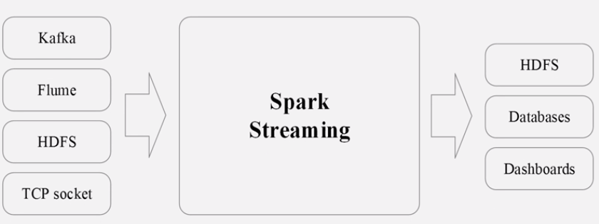
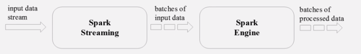
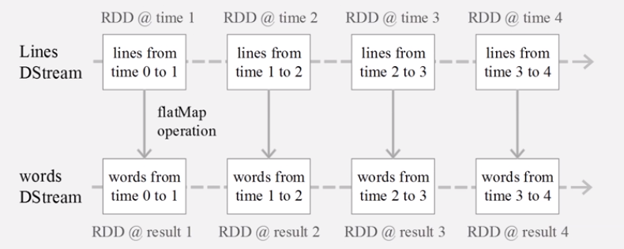
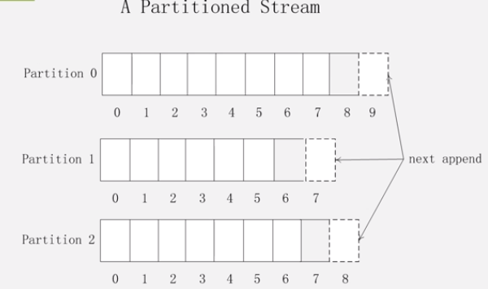
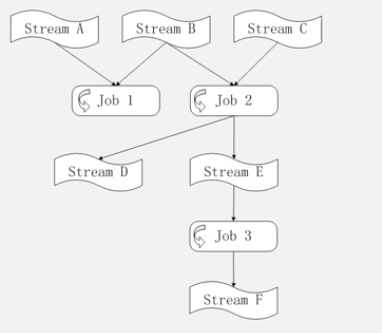

#实时计算系统第三次作业

###黄郭斌 计科1502班 201507010206

##流式大数据处理的三种Apache框架：Storm, Spark, Samza

###1) 各有什么特点？各有什么优缺点和差异性？

####Storm

实时流计算框架。特点如下：

1. 整合性：Strom可以方便地与队列系统和数据库系统整合
2. 简易API：便于二次开发
3. 可扩展性：Strom的并行特性使其可以运行在分布式集群中
4. 容错性：可以自动进行故障结点的重启，结点故障时任务的重新分配
5. 可靠的消息处理：能保证每个消息都得到完整处理
6. 支持各种编程语言
7. 快速部署：仅仅需要少数的安装和配置就可以快速实现部署和使用
8. 免费开源

#### Spark Streaming

注意实际上Spark是常见的批处理框架，通过内存计算使得其计算效率得到大幅提升，但是整体并不是流处理的框架。Spark Streaming是Spark的核心组件之一，为Spark提供了可扩展，高吞吐，容错的流计算能力。

特点：

1. 可以整合多种数据源：Kafka, Flume, HDFS, 甚至是普通的TCP套接字。经过处理的数据可以储存至HDFS, 数据库，或者显示在仪表盘里面。如下图：

   

2. Spark Streaming的基本原理就是将实时输入的数据流以时间片（秒级）为单位进行拆分，然后经Spark引擎以类似批处理的方式来处理每个时间片数据：

   

3. Spark Streaming最主要的抽象是Dstream(Discretized Stream,离散化的数据流)，表示连续不断的数据流。每个时间片的数据为一个Dstream，每段数据转换为Spark中的RDD，对Dstream的操作都最终转换为对应的RDD操作。

   

#### Spark Streaming和Storm的差别（各自的优缺点）

Spark Streaming无法实现毫秒级的流计算，而Storm可以实现毫秒级的响应。

Sparking Streming相比起Storm，RDD数据集更容易做高效的容错处理。

Spark Streaming采用小批量处理的方式，使得它可以同时兼容批量和实时数据处理的逻辑和算法。方便了一些需要历史数据和实时数据联合分析的特定应用场合。

#### Samza

特点：

数据处理的单位是**消息**（Storm里面是Tuple, Spark Streaming里面是Dstream）。

每个流都会被分割成一个或多个**分区**（Partition）。每个分区都是一个有序的消息序列：

一个**作业**(Job)会被进一步分割为多个**任务**(Task)来执行。每个任务负责处理作业中的一个分区。

分区之间没有定义顺序，从而允许每一个任务独立执行。

**YARN调度器**负责把任务分发给各个机器，一个Job中的多个任务都会被分发到不同的机器中进行分布式处理。

通过将多个作业串联起来，构成一个完整的数据流图才可以完成一个完整的流处理数据流程：

Samza框架由**流数据层**，**执行层**，**处理层**组成（功能和批处理对比）：

|        | MapReduce批处理框架 | Samza流处理框架 |
| :----: | :-----------------: | :-------------: |
| 数据层 |        HDFS         |      Kafka      |
| 执行层 |        YARN         |      YARN       |
| 处理层 |      MapReduce      |    Samza API    |

#### Strom, Spark Streaming, Samza三种流计算框架的比较

编程灵活性来讲，Storm是比较灵活的选择。响应时间要求高的场景。

当需要在一个集群中把流计算和图计算、机器学习、SQL查询分析等进行结合时，可以选择Sparking Streaming。

当有大量的状态需要处理的时候，比如说每个分区都有数十亿个元组则可以选择Samza。（响应时间要求高的场景）

###2) 各有哪些公司产品代表？试举2-3个详细说明。

流计算框架：

IBM InfoSphere Stream, Twitter Stream, Facebook Puma, Yahoo! S4等。

举例：

**Yahoo! S4**(Simple Scalable Streaming System): **开源**的流计算平台，是通用的、分布式的、可扩展的、分区容错的、可插拔的流式系统。

**IBM InfoSphere Stream**：**商业级**流计算平台，可以帮助用户开发应用程序来快速摄取、分析和关联来自数千个实时源的信息。

### 3) Storm vs. Hadoop

####Storm是流处理框架，处理的是流数据

流数据的特点是数据以大量，快速，时变的流的形式到达。由于流数据的价值往往会随着时间的推移而迅速下降，因此要求数据处理框架能够在较低延迟内给出分析结果。由于这种特点，要求流处理框架能够在低延迟的条件下给出分析结果，并能够主动做出实时分析（而批处理是一般是用户来主动进行查询操作）。Strom就是应用在这种业务场景下的。

####Hadoop是批处理框架，处理的是静态数据

静态数据来自于不同的数据源，通过ETL工具加载到数据仓库中，不会发生实时的更新，技术人员可以利用数据挖掘和OLAP分析工具从这些静态数据中找到对企业有价值的数据。

由于静态数据的这种特点，适合使用批处理的方式来处理数据，批处理的特点是吞吐量大，可以一次处理大量的数据，但是延迟相对较高，Hadoop就是用来处理这种数据的。

