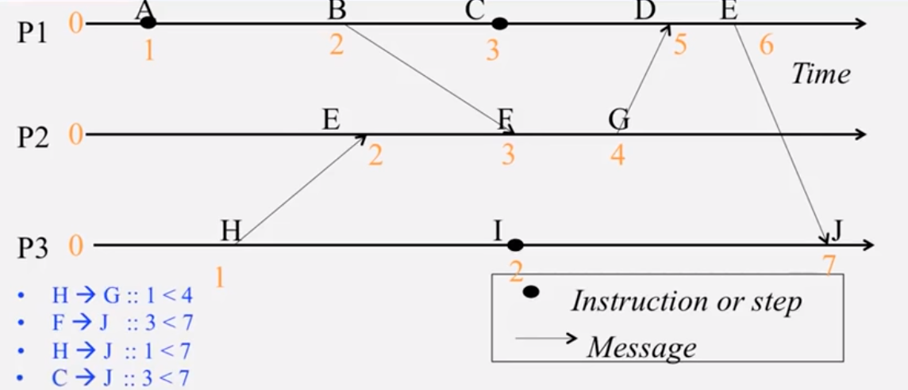

#实时计算系统第四次作业

###黄郭斌 计科1502班 201507010206

##Q1: 实时计算环境下，有哪些时钟同步策略与算法？各有什么优缺点？

1. **Cristian's Algorithm**

   

   **特点**：External Synchronization(有外部的时钟源S)，通过上图的方法来进行时钟的同步，P收到时候的真实时间可以被约束在$$[t+min2, t+RTT-min1]$$之间。（通过取平均值来作为P的本地时钟时间）

   Cristian's Algorithm, 以及之后描述的NTP,  Berkeley Algorithm的共同缺点是由于RTT的存在，你无法避免时钟公布同步过程中带来的误差(但是都能被bound在RTT时间内)。

2. **NTP**

   

   **特点**：External Synchronization(有外部的时钟源S)，是一种在Internet based系统中的授时协议，其中授时服务器通过以下拓扑来进行组织：

   

3. **Berkeley Algorithm**

   授时过程如下：

   > 1. A *master* is chosen via an [election process](https://en.wikipedia.org/wiki/Leader_election) such as [Chang and Roberts algorithm](https://en.wikipedia.org/wiki/Chang_and_Roberts_algorithm).
   > 2. The *master* polls the *slaves* who reply with their time in a similar way to [Cristian's algorithm](https://en.wikipedia.org/wiki/Cristian%27s_algorithm).
   > 3. The *master* observes the [round-trip time](https://en.wikipedia.org/wiki/Round-trip_time) (RTT) of the messages and estimates the time of each *slave* and its own.
   > 4. The *master* then averages the clock times, ignoring any values it receives far outside the values of the others.
   > 5. Instead of sending the updated current time back to the other process, the *master* then sends out the amount (positive or negative) that each *slave* must adjust its clock. This avoids further uncertainty due to RTT at the *slave* processes.

   **特点**：

    	1. Internal Synchronization(没有外部的时钟源)
   	2. master通过获得每个slave的本地系统时间并取平均值可以很好地估计出该系统的平均时间。
   	3. 忽略掉偏差太大的时间有利于防止整个系统的时间因为一个错误的时钟而严重偏斜。
   	4. master向每个slave发送需要调整其时钟的量（正或负），而不是将更新的当前时间发送回另一个进程，这避免了发送package过程中带来的RTT导致的进一步不确定性。

4. **Lamport logical clocks时钟同步算法**

   **特点**：完全不需要进行process之间（可能在不同的机器上）的时钟同步，使用遵守**causality**的timestamp来排序事件。

   如下是一个使用Lamport logical clocks来对processes中的event进行排序的例子：

   

5. **Vector Clocks时钟同步算法**

   特点：

   它比Lamport更好的是他能识别出Concurrent events.

   

   

   

   

   

##Q2: 试针对其中两种，说明应用场景。

1. 实时操作系统**VxWorks**使用**NTP协议**来进行网络授时：

   其内核响应速度快，可以方便地支持实时处理，克服了以往开发网络授时服务器的弊端。

2. **Unix中的make工具**由于不需要与UTC时间进行校准，但是需要在不同processes之间进行排程，所以使用 了**Berkeley Algorithm**来进行时钟同步。