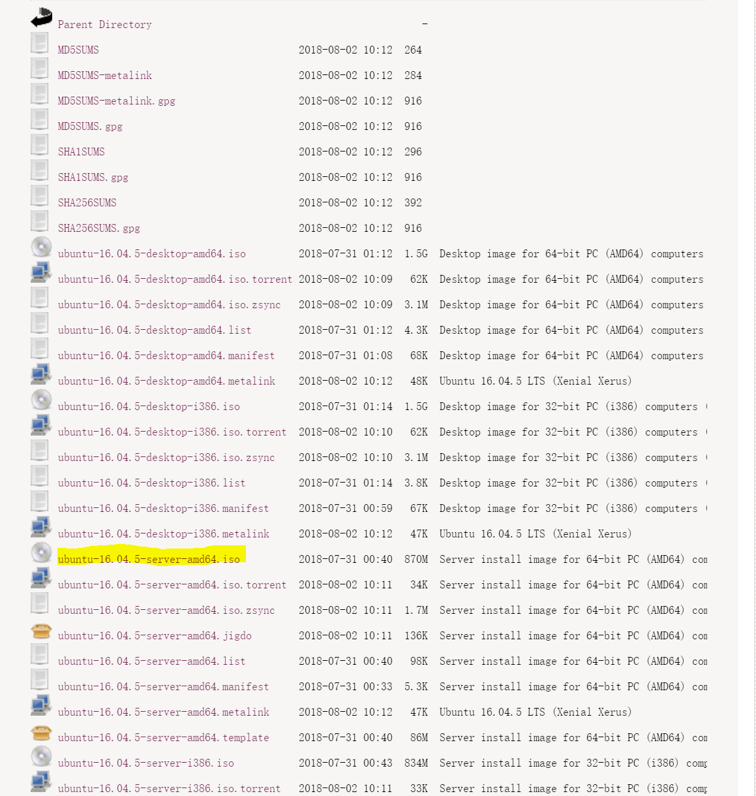

#安装双系统教程


###Windows 10系统下安装Ubuntu

####1.官网下载系统镜像

我们在服务器上安装的是Ubuntu Server 16.04 LTS版本，此版本可以从Ubuntu官网上下载镜像，下载地址如下：

http://releases.ubuntu.com/xenial/



#### 2. 制作启动盘

这里注意，我在安装的时候由于使用了不规范的启动盘制作软件，导致在安装过程中出现了以下的问题：

1. 安装界面显示异常（无法显示出完整的安装界面，只显示了部分界面）
2. 安装过程需要再次从网络中下载镜像（我猜测是由于制作的镜像不完整导致无法识别）
3. 安装完成后，服务器开机无法正常显示。（解决办法请参考：https://blog.csdn.net/qq_33588730/article/details/81108563）

这里我最后是通过`Win32DiskImager`这款软件完成的安装，果哥推荐了官方的启动U盘制作软件`Rufus`，故之后安装Ubuntu双系统推荐选择该软件来进行启动盘的制作，教程链接如下：

https://tutorials.ubuntu.com/tutorial/tutorial-create-a-usb-stick-on-windows#1

**请务必选择推荐的启动盘制作方式！**

###3. 创建Ubuntu的磁盘分区

在控制面板—>管理工具—>计算机管理—>磁盘管理 里修改磁盘分区信息，留出部分空白分区给Ubuntu用。分好区以后如下图，我在服务器中选择的是300G的空间。


###4. **从U盘启动安装系统** 

在网上搜索到你电脑快速进入BOOT的快捷键是什么（Dell R720的话就在启动过程中跳出DELL商标的时候疯狂按`F2`就好了），打开电源后按下快捷键，出现BOOT选择界面，选择U盘为第一启动项目。

> 注意：我们的服务器（Dell R720）如果在下一次重启的时候没有继续将U盘接在服务器上，则会自动将硬盘重新设置为第一启动项，因此如果你下次插入U盘的时候，还是会优先从硬盘启动，如果需要从U盘启动则需要重新设置启动顺序。

###5. 按照安装向导安装Ubuntu

这里可以参考：https://www.cnblogs.com/jimmycan/p/5980515.html 这个教程，基本的流程是一样的，需要注意以下两点：

1. **配网**：安装过程中会提示你设置IP, DNS, 默认网关, 子网掩码等信息，这个可以在安装过程中就配置好，也可以在安装完成后进入`/etc/network/interfaces`进行配置（如果是网络安装模式则一定需要在安装过程中设置好网络配置信息，否则建议直接跳过，之后进行配置）。

   注意配网过程中，向导会让你选择需要配置哪个网卡（在成功安装后使用`ifconfig -a`看到的也类似），这是由于我们的服务器上装有多个网卡，因此需要找到连接到外网的网口配置才有效果。此过程只能穷举法一个个进行尝试配置，但是安装过程中可以通过观察物理机背后的网线实际连接的网口，猜测出大致对应的是显示的哪个网口（每张网卡的不同网口名字是类似的）。

   以下是安装好之后进入``/etc/network/interfaces``进行的配置样例：

   ```
   iface eno1 inet static
   	address 10.0.4.1
   	gateway 10.0.0.1
   	netmask 255.255.0.0
   	dns-nameservers 114.114.114.114 114.114.115.115
   ```

   配置好之后使用`sudo /etc/init.d/networking restart `来重启网卡使配置生效。

2. **分区**：建议选择两个分区：`/`分区和`swap space`。交换空间的大小推荐选择内存的一倍至两倍大小（如服务器的内存是32G，我选择了32G作为交换空间大小），剩余的空间均交给根分区。

3. **GRUB启动引导器的写入**

   背景知识：

   1. grub是一个在物理机中有多个系统的时候，选择引导哪个系统的工具，详细的介绍请自行百度。
   2. 系统启动顺序：BIOS -> MBR中的BootLoader -> OS Kernel中的启动程序 -> 整个OS （详细的启动顺序由于操作系统课已学过就不展开介绍了），这里的grub就是一种BootLoader。

   在有多块硬盘的时候，请务必将grub覆盖原有的BootLoader（在原来的启动盘的），这样才能保证能够正常开机（我在安装的时候，是sda1）。